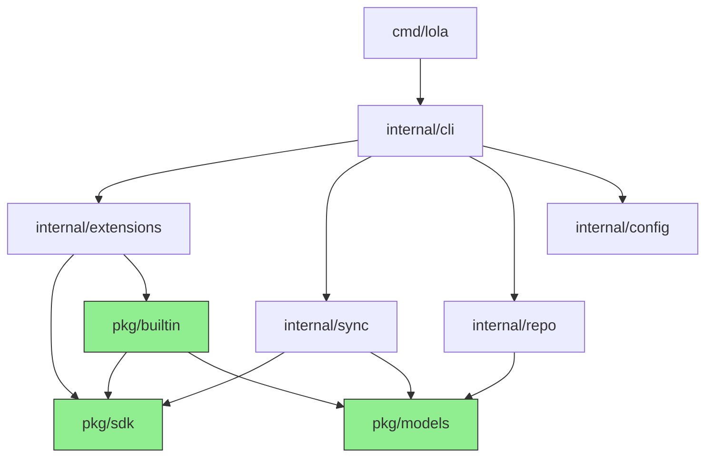

# Go Project Structure — Implementation Design

Paired with [ADR-0004: Go Project
Structure](../../adr/0004-go-project-structure.md).

This tree implements [ADR-0003: Extension
Architecture](../../adr/extension-architecture.md): built-in extensions are
compiled into the `lola` binary, external extensions run as subprocesses. A
change to that boundary changes this tree.

## Module Path

```
module github.com/LobsterTrap/lola
```

Extension developers import the public packages at:

```go
import (
    "github.com/LobsterTrap/lola/pkg/sdk"
    "github.com/LobsterTrap/lola/pkg/models"
)
```

## File Tree

```
cmd/
  lola/
    main.go                       # Thin entry, calls internal/cli

internal/
  cli/                            # Cobra commands — one file per subcommand
    root.go                       # Root command, version, shell completion
    mod.go                        # lola mod add|rm|ls|update|info|search
    skill.go                      # lola skill add|rm|ls|info|search
    plugin.go                     # lola plugin add|rm|ls|info|search
    group.go                      # lola group add|rm|ls|info|install
    repo.go                       # lola repo add|rm|ls|update|set
    ext.go                        # lola ext add|rm|ls|info|search
    install.go                    # lola install <module> -a <target>
    update.go                     # lola update
    search.go                     # lola search <query> [--type mod|skill|plugin|ext]

  extensions/                     # Extension discovery and lifecycle
    registry.go                   # Factory maps for built-in extensions
    discovery.go                  # Scan extension dir + PATH for externals
    runner.go                     # Execute external extensions via stdin/stdout

  config/                         # Viper configuration
    config.go                     # LOLA_HOME, MODULES_DIR, INSTALLED_FILE, etc.

  sync/                           # Install/uninstall/update orchestration
    install.go                    # InstallToTarget(), CopyModuleToLocal()
    update.go                     # UpdateModule(), compute orphans
    uninstall.go                  # remove from target + registry

  frontmatter/                    # YAML frontmatter parser
    parse.go                      # ParseFrontmatter(content, v) (body, err)

  repo/                           # Repository/marketplace management
    manager.go                    # RepoRegistry: add, update, search, resolve
    search.go                     # Cross-repo module search

pkg/
  sdk/                            # PUBLIC extension SDK
    extension.go                  # Base Extension interface, Kind type
    manifest.go                   # ExtensionManifest struct (YAML schema)
    target.go                     # TargetExtension interface
    source.go                     # SourceExtension interface
    repo.go                       # RepoExtension interface

  builtin/                        # PUBLIC built-in extension implementations
    targets/
      claude_code.go              # Separate files, .claude/ paths
      cursor.go                   # Separate files, .cursor/ paths
      gemini.go                   # Managed section in GEMINI.md
      openclaw.go                 # Workspace-based
      opencode.go                 # Managed section in AGENTS.md
    sources/
      git.go                      # go-git/v5 shallow clone
      zip.go                      # stdlib archive/zip
      tar.go                      # stdlib archive/tar
      folder.go                   # os.CopyFS
      oci.go                      # imports skillimage pkg/oci
    repos/
      yaml.go                     # Standard YAML catalog handler
      oci.go                      # OCI registry catalog

  models/                         # PUBLIC shared model types
    module.go                     # Module, Skill, Command, Agent
    installation.go               # Installation, InstallationRegistry
    repo.go                       # Repo (was Marketplace)
    group.go                      # Group definition
```

`pkg/sdk/` declares interfaces only for extension kinds that have an
implementation. The `runtime` and `scan` kinds are reserved in the extension
architecture ADR but have no built-ins; their interfaces are added when the
first implementation lands, so the public API never carries a shape nothing has
exercised.

## Package Dependency Flow



Green = public (`pkg/`), white = private (`internal/`).

### Import Rule

**`pkg/` must never import `internal/`.** Dependencies flow one way: `cmd/` →
`internal/` → `pkg/`.

The Go compiler only enforces half of this. It blocks code *outside* this module
from importing `internal/`, but nothing stops `pkg/sdk` from importing
`internal/config` — they are in the same module. A violation would make the
public API silently depend on private code, defeating the boundary the ADR is
built on.

Enforce it in CI:

```bash
if go list -deps ./pkg/... | grep -q '^github.com/LobsterTrap/lola/internal/'; then
    echo "violation: pkg/ imports internal/" >&2
    exit 1
fi
```

## Cobra Command Registration

Each command file in `internal/cli/` exports a `NewXxxCmd()` constructor, and
`root.go` registers them explicitly. No `init()`-based self-registration, so the
command tree is readable in one place and command order is deterministic.
